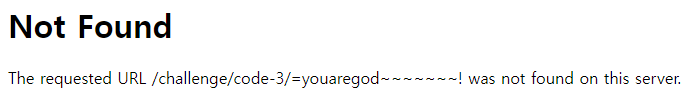

##### 해당 게시글은 빡공팟 4기(with TeamH4C)와 관련되어 있습니다

-----

# > Webhacking.kr:old-34(js)

## 삽질


접속하자마자 디버깅 해달라는 문구와


PTSD오는 난독화 된 자바스크립트가 반겼다.

```javascript
var a = ['RcOhTDV1Ew==', 'McOVwqpRBg==', 'c8K/w43DvcK8', 'SsOrTCF1CVDCgcKLEsKc', 'NsK/w4Bc', 'G1TDpwk=', 'AcKtwqfDlW7Dsw==', 'e3kkcQJfwoNFDEU9', 'QMOXDBo=', 'w5bCsWlh', 'eWY6bg8=', 'FnbDoEvDtl1LUkB7w4Q=', 'esOZTiPDsg==', 'bzfCkFfCtA==', 'ZmzDjHcn', 'PxLCm3LDvA==', 'IcKlVy9pw57DgMK3w6kmwpvCiUnDhcOKw4A=', 'LMKnwqECawEeEMOZQsK7wrLCscKpSG1AwqvDvjnDpMKhOSDCqQfDmVRowo1nwpzCh8OGc1vDv3cKVR/CgMK4w7PCukbCv8O8woNHXcK7SsOmMhHDnUEJw4lsw6g=', 'wrTDnltl', 'UMOXHRs=', 'Tz0lw48=', 'O8K0w5JcwrA=', 'w5DCpnx/LA==', 'HsKrS8KVQw==', 'dcKvfnkhUQ3DncOFIsOew5lHwr7CjcKYAsOuwrc3UjhfwopNwqwuWcOjw4PDrkIRWAfCnSIdw5jDtsKyWFBMwq4YMQvDhRrCrlBlw71LUR5HGMKwEBs=', 'w4RAw5xg', 'RkQSNA==', 'SsOsQztv', 'wonDvMOwwow=', 'wovDlMKvw5nCog==', 'w73Ch8K5VcK/', 'wpN7HsOMwpI=', 'w5/CuMKDacOKPcKoB3jDomQ=', 'wpnDvMOhwo0=', 'wp4xwrvDvA==', 'H1LDrhc=', 'wo86woHDm37Dow==', 'woY4wobDmg==', 'wr/CgMKQNcOo', 'ecOlUSF2S3fCsMKbGQ==', 'E3nCrcKe', 'w5d5w6HDnsOFw7RcRFjDosKsZ8OHEcOv', 'QMOXDBrCrcKLwp3DvA==', 'w5fDsiPDrsOf', 'V3c3A0Q=', 'E8OjwpNaP1lDTMKXcsO5', 'G08JPDZMw5s8w4ITw54dEMKAwps=', 'wo8pwoXDnmg=', 'wpo5wqvDoMOQw6Jd', 'bH4+TyM='];
(function(c, d) {
    var e = function(f) {
        while (--f) {
            c['push'](c['shift']());
        }
    };
    var g = function() {
        var h = {
            'data': {
                'key': 'cookie',
                'value': 'timeout'
            },
            'setCookie': function(i, j, k, l) {
                l = l || {};
                var m = j + '=' + k;
                var n = 0x0;
                for (var n = 0x0, p = i['length']; n < p; n++) {
                    var q = i[n];
                    m += ';\x20' + q;
                    var r = i[q];
                    i['push'](r);
                    p = i['length'];
                    if (r !== !![]) {
                        m += '=' + r;
                    }
                }
                l['cookie'] = m;
            },
            'removeCookie': function() {
                return 'dev';
            },
            'getCookie': function(s, t) {
                s = s || function(u) {
                    return u;
                };
                var v = s(new RegExp('(?:^|;\x20)' + t['replace'](/([.$?*|{}()[]\/+^])/g, '$1') + '=([^;]*)'));
                var w = function(x, y) {
                    x(++y);
                };
                w(e, d);
                return v ? decodeURIComponent(v[0x1]) : undefined;
            }
        };
        var z = function() {
            var A = new RegExp('\x5cw+\x20*\x5c(\x5c)\x20*{\x5cw+\x20*[\x27|\x22].+[\x27|\x22];?\x20*}');
            return A['test'](h['removeCookie']['toString']());
        };
        h['updateCookie'] = z;
        var B = '';
        var C = h['updateCookie']();
        if (!C) {
            h['setCookie'](['*'], 'counter', 0x1);
        } else if (C) {
            B = h['getCookie'](null, 'counter');
        } else {
            h['removeCookie']();
        }
    };
    g();
}(a, 0xa2));
var b = function(c, d) {
    c = c - 0x0;
    var e = a[c];
    if (b['clOwyu'] === undefined) {
        (function() {
            var f = function() {
                var g;
                try {
                    g = Function('return\x20(function()\x20' + '{}.constructor(\x22return\x20this\x22)(\x20)' + ');')();
                } catch (h) {
                    g = window;
                }
                return g;
            };
            var i = f();
            var j = 'ABCDEFGHIJKLMNOPQRSTUVWXYZabcdefghijklmnopqrstuvwxyz0123456789+/=';
            i['atob'] || (i['atob'] = function(k) {
                var l = String(k)['replace'](/=+$/, '');
                for (var m = 0x0, n, o, p = 0x0, q = ''; o = l['charAt'](p++); ~o && (n = m % 0x4 ? n * 0x40 + o : o, m++ % 0x4) ? q += String['fromCharCode'](0xff & n >> (-0x2 * m & 0x6)) : 0x0) {
                    o = j['indexOf'](o);
                }
                return q;
            });
        }());
        var r = function(s, d) {
            var u = [],
                v = 0x0,
                w, x = '',
                y = '';
            s = atob(s);
            for (var z = 0x0, A = s['length']; z < A; z++) {
                y += '%' + ('00' + s['charCodeAt'](z)['toString'](0x10))['slice'](-0x2);
            }
            s = decodeURIComponent(y);
            for (var B = 0x0; B < 0x100; B++) {
                u[B] = B;
            }
            for (B = 0x0; B < 0x100; B++) {
                v = (v + u[B] + d['charCodeAt'](B % d['length'])) % 0x100;
                w = u[B];
                u[B] = u[v];
                u[v] = w;
            }
            B = 0x0;
            v = 0x0;
            for (var C = 0x0; C < s['length']; C++) {
                B = (B + 0x1) % 0x100;
                v = (v + u[B]) % 0x100;
                w = u[B];
                u[B] = u[v];
                u[v] = w;
                x += String['fromCharCode'](s['charCodeAt'](C) ^ u[(u[B] + u[v]) % 0x100]);
            }
            return x;
        };
        b['wxbdQn'] = r;
        b['ZjQald'] = {};
        b['clOwyu'] = !![];
    }
    var D = b['ZjQald'][c];
    if (D === undefined) {
        if (b['XvSLaK'] === undefined) {
            var E = function(F) {
                this['swkpev'] = F;
                this['DGOTpS'] = [0x1, 0x0, 0x0];
                this['zlbdZJ'] = function() {
                    return 'newState';
                };
                this['KCuPKs'] = '\x5cw+\x20*\x5c(\x5c)\x20*{\x5cw+\x20*';
                this['AnZPoE'] = '[\x27|\x22].+[\x27|\x22];?\x20*}';
            };
            E['prototype']['DCDTIR'] = function() {
                var G = new RegExp(this['KCuPKs'] + this['AnZPoE']);
                var H = G['test'](this['zlbdZJ']['toString']()) ? --this['DGOTpS'][0x1] : --this['DGOTpS'][0x0];
                return this['ZjMdYn'](H);
            };
            E['prototype']['ZjMdYn'] = function(I) {
                if (!Boolean(~I)) {
                    return I;
                }
                return this['LqSTke'](this['swkpev']);
            };
            E['prototype']['LqSTke'] = function(J) {
                for (var K = 0x0, L = this['DGOTpS']['length']; K < L; K++) {
                    this['DGOTpS']['push'](Math['round'](Math['random']()));
                    L = this['DGOTpS']['length'];
                }
                return J(this['DGOTpS'][0x0]);
            };
            new E(b)['DCDTIR']();
            b['XvSLaK'] = !![];
        }
        e = b['wxbdQn'](e, d);
        b['ZjQald'][c] = e;
    } else {
        e = D;
    }
    return e;
};
var e = function() {
    var c = !![];
    return function(d, e) {
        var f = c ? function() {
            if (e) {
                var g = e['apply'](d, arguments);
                e = null;
                return g;
            }
        } : function() {};
        c = ![];
        return f;
    };
}();
var Q = e(this, function() {
    var c = function() {
            return '\x64\x65\x76';
        },
        d = function() {
            return '\x77\x69\x6e\x64\x6f\x77';
        };
    var e = function() {
        var f = new RegExp('\x5c\x77\x2b\x20\x2a\x5c\x28\x5c\x29\x20\x2a\x7b\x5c\x77\x2b\x20\x2a\x5b\x27\x7c\x22\x5d\x2e\x2b\x5b\x27\x7c\x22\x5d\x3b\x3f\x20\x2a\x7d');
        return !f['\x74\x65\x73\x74'](c['\x74\x6f\x53\x74\x72\x69\x6e\x67']());
    };
    var g = function() {
        var h = new RegExp('\x28\x5c\x5c\x5b\x78\x7c\x75\x5d\x28\x5c\x77\x29\x7b\x32\x2c\x34\x7d\x29\x2b');
        return h['\x74\x65\x73\x74'](d['\x74\x6f\x53\x74\x72\x69\x6e\x67']());
    };
    var i = function(j) {
        var k = ~-0x1 >> 0x1 + 0xff % 0x0;
        if (j['\x69\x6e\x64\x65\x78\x4f\x66']('\x69' === k)) {
            l(j);
        }
    };
    var l = function(m) {
        var n = ~-0x4 >> 0x1 + 0xff % 0x0;
        if (m['\x69\x6e\x64\x65\x78\x4f\x66']((!![] + '')[0x3]) !== n) {
            i(m);
        }
    };
    if (!e()) {
        if (!g()) {
            i('\x69\x6e\x64\u0435\x78\x4f\x66');
        } else {
            i('\x69\x6e\x64\x65\x78\x4f\x66');
        }
    } else {
        i('\x69\x6e\x64\u0435\x78\x4f\x66');
    }
});
Q();
var q = function() {
    var r = !![];
    return function(s, t) {
        var u = r ? function() {
            if (b('0x0', 'hezG') !== b('0x1', 'A6hd')) {
                if (t) {
                    if (b('0x2', 'G(vo') === b('0x3', 'K*$C')) {
                        q(this, function() {
                            var j = new RegExp(b('0x4', '$VvG'));
                            var k = new RegExp(b('0x5', '2@LG'), 'i');
                            var l = H(b('0x6', 'k(C)'));
                            if (!j[b('0x7', '14cN')](l + 'chain') || !k[b('0x8', 'aEot')](l + b('0x9', 'ln]I'))) {
                                l('0');
                            } else {
                                H();
                            }
                        })();
                    } else {
                        var z = t[b('0xa', '$ybZ')](s, arguments);
                        t = null;
                        return z;
                    }
                }
            } else {
                var f = r ? function() {
                    if (t) {
                        var g = t[b('0xb', 'C%Xw')](s, arguments);
                        t = null;
                        return g;
                    }
                } : function() {};
                r = ![];
                return f;
            }
        } : function() {};
        r = ![];
        return u;
    };
}();
(function() {
    q(this, function() {
        var D = new RegExp('function\x20*\x5c(\x20*\x5c)');
        var E = new RegExp(b('0xc', 'RLUb'), 'i');
        var F = H(b('0xd', 'iWKi'));
        if (!D[b('0xe', 'ho]6')](F + b('0xf', 'RLUb')) || !E[b('0x10', 'X!$R')](F + b('0x11', 'RUTX'))) {
            if (b('0x12', 'J[i1') === b('0x13', 'Pa4(')) {
                F('0');
            } else {
                (function() {
                    return !![];
                } [b('0x14', 'kK4Z')](b('0x15', 'X!$R') + b('0x16', 'llaF'))[b('0x17', '3R^0')](b('0x18', 'iUmC')));
            }
        } else {
            H();
        }
    })();
}());
setInterval(function() {
    H();
}, 0xfa0);
if (location[b('0x19', 'iUmC')][b('0x1a', '6]r1')](0x1) == b('0x1b', 'RLUb')) location[b('0x1c', '4c%d')] = b('0x1d', 'llaF');
else alert(b('0x1e', '14cN'));

function H(I) {
    function J(K) {
        if (b('0x1f', 'oYXf') !== b('0x20', 'ho]6')) {
            return J;
        } else {
            if (typeof K === 'string') {
                return function(M) {} [b('0x21', '2@LG')](b('0x22', 'joDm'))[b('0x23', 'iUmC')](b('0x24', 'llaF'));
            } else {
                if ('thtMU' === b('0x25', 'Am%6')) {
                    if (('' + K / K)[b('0x26', 'RLUb')] !== 0x1 || K % 0x14 === 0x0) {
                        if (b('0x27', '2@LG') !== b('0x28', 'bO4C')) {
                            return !![];
                        } else {
                            (function() {
                                return !![];
                            } [b('0x29', 'RLUb')](b('0x2a', 'ln]I') + b('0x2b', '3R^0'))['call'](b('0x2c', 'c3hQ')));
                        }
                    } else {
                        (function() {
                            return ![];
                        } [b('0x2d', 'Am%6')](b('0x2e', '14cN') + b('0x2f', '$ybZ'))[b('0x30', 'Am%6')](b('0x31', 'O!T!')));
                    }
                } else {
                    H();
                }
            }
            J(++K);
        }
    }
    try {
        if (I) {
            return J;
        } else {
            J(0x0);
        }
    } catch (P) {}
}
```


그리고 이게 끝이 아니라 


웹 페이지에서 이런게 떠있었는데 잠시 보류

<br><br><br>

-----

# > Webhacking.kr:old-58(js)

## 삽질


다양한 리눅스 명령어를 쳐보다가 우연히 "help" 를 입력했고 가능한 명령어가 나오는 듯 했다.


"flag" 명령어에서 admin만 가능하다고 한다. 아니 내가 지금 root가 짱아니여!?


```javascript
    $(function () {
      var username = "guest";
      var socket = io();
      $('form').submit(function(e){
        e.preventDefault();
        socket.emit('cmd',username+":"+$('#m').val());
        $('#m').val('');
        return false;
      });
      socket.on('cmd', function(msg){
        $('#messages').append($('<li>').text(msg));
      });
    });
```

소켓 통신으로 웹 채팅을 구현할 수 있다던 잡지식이 떠올라 눈치적으로 서버에게 명령어를 전달하고 이 결과를 받아오는 코드라고 생각했다. 구글링을 통해 검색해보니 `socket.emit` 은 데이터를 전송하는 함수이고, `socket.on`은 데이터를 수신하는 함수라고 한다. 즉, `emit()`의 인자로 현재 'cmd'와 'guest:명령어' 를 넣어 전달하고 있고, `on()`은 서버측에서 보낸 `emit()`의 값을 전달받는 것 같다. 이 때 'cmd'가 소켓명으로써 서버와 클라이언트가 동일하게 써야한다고 한다.

그렇다면 서버측에서도 'cmd'라는 소켓명을 사용중이고, 나는 지금 "admin"으로써 명령어를 전달해야 한다. 

<br>

## writeup

앞선 소스 코드로 서버에 요청을 보내는 방법을 알았다.

```javascript
var socket=io();
socket.emit('cmd',"admin:flag");
```

이후 서버로부터의 응답을 출력하기만 하면 되는데, `on` 함수는 `emit`과 형태가 조금 다른 듯하다. 다른 소켓.io를 이용한 코드들을 보니 소켓명 다음에 `function(메세지)` 형식으로 사용하여 데이터를 주고 받는 듯하다.

```javascript
socket.on('cmd',function(data){console.log(data);});
```


이렇게 플래그를 얻었다.


<br><br><br>

-----

# > Webhacking.kr:old-4(laptop)

## 삽질

```php
<?php
  sleep(1); // anti brute force
  if((isset($_SESSION['chall4'])) && ($_POST['key'] == $_SESSION['chall4'])) solve(4);
  $hash = rand(10000000,99999999)."salt_for_you";
  $_SESSION['chall4'] = $hash;
  for($i=0;$i<500;$i++) $hash = sha1($hash);
?>
```

문제에서 나는 "key"값을 맞춰야한다. "key"는 1천만부터 1억미만의 숫자를 선택한 뒤에 "salt_for_you"라는 문자를 합친 값이다. 그리고 이 값을 `sha1()`의 인자로 넣고 500번 수행한 결과를 나에게 보내준다.

한 선배가 앱을 만드는 것을 구경할 때 DB 구축하는 것을 엿본적이 있었다. 그리고 비밀번호를 저장하는 과정에서 salt 값을 추가하여 암호화하는 것을 보았었는데 이걸 여기서 보게될 줄이야. 

sha1을 복호화할 수 있다는 사실은 알고 있지만 그것이 여러번 암호화되었을 때 복호화 할 수 있다는 말은 들어본 적이 없다. 또한 sleep에 의해 브루트포싱 한다해도 대충 9천만초, 즉 25000시간을 기다려야 한다. 이거 어떻게 푸누?


<br><br><br>

-----

# > Webhacking.kr:old-6(laptop)

## 삽질

```php
<?php
include "../../config.php";
if($_GET['view_source']) view_source();
if(!$_COOKIE['user']){
  $val_id="guest";
  $val_pw="123qwe";
  for($i=0;$i<20;$i++){
    $val_id=base64_encode($val_id);
    $val_pw=base64_encode($val_pw);
  }
  $val_id=str_replace("1","!",$val_id);
  $val_id=str_replace("2","@",$val_id);
  $val_id=str_replace("3","$",$val_id);
  $val_id=str_replace("4","^",$val_id);
  $val_id=str_replace("5","&",$val_id);
  $val_id=str_replace("6","*",$val_id);
  $val_id=str_replace("7","(",$val_id);
  $val_id=str_replace("8",")",$val_id);

  $val_pw=str_replace("1","!",$val_pw);
  $val_pw=str_replace("2","@",$val_pw);
  $val_pw=str_replace("3","$",$val_pw);
  $val_pw=str_replace("4","^",$val_pw);
  $val_pw=str_replace("5","&",$val_pw);
  $val_pw=str_replace("6","*",$val_pw);
  $val_pw=str_replace("7","(",$val_pw);
  $val_pw=str_replace("8",")",$val_pw);

  Setcookie("user",$val_id,time()+86400,"/challenge/web-06/");
  Setcookie("password",$val_pw,time()+86400,"/challenge/web-06/");
  echo("<meta http-equiv=refresh content=0>");
  exit;
}
?>
<html>
<head>
<title>Challenge 6</title>
<style type="text/css">
body { background:black; color:white; font-size:10pt; }
</style>
</head>
<body>
<?php
$decode_id=$_COOKIE['user'];
$decode_pw=$_COOKIE['password'];

$decode_id=str_replace("!","1",$decode_id);
$decode_id=str_replace("@","2",$decode_id);
$decode_id=str_replace("$","3",$decode_id);
$decode_id=str_replace("^","4",$decode_id);
$decode_id=str_replace("&","5",$decode_id);
$decode_id=str_replace("*","6",$decode_id);
$decode_id=str_replace("(","7",$decode_id);
$decode_id=str_replace(")","8",$decode_id);

$decode_pw=str_replace("!","1",$decode_pw);
$decode_pw=str_replace("@","2",$decode_pw);
$decode_pw=str_replace("$","3",$decode_pw);
$decode_pw=str_replace("^","4",$decode_pw);
$decode_pw=str_replace("&","5",$decode_pw);
$decode_pw=str_replace("*","6",$decode_pw);
$decode_pw=str_replace("(","7",$decode_pw);
$decode_pw=str_replace(")","8",$decode_pw);

for($i=0;$i<20;$i++){
  $decode_id=base64_decode($decode_id);
  $decode_pw=base64_decode($decode_pw);
}

echo("<hr><a href=./?view_source=1 style=color:yellow;>view-source</a><br><br>");
echo("ID : $decode_id<br>PW : $decode_pw<hr>");

if($decode_id=="admin" && $decode_pw=="nimda"){
  solve(6);
}
?>
</body>
</html>
```

`user`와 `password`라는 쿠키값을 `str_replace` 함수와 `base64_decode` 함수를 거친 결과가 각각 "admin"과 "nimda"가 되어야 한다.

<br>

## writeup

인코딩하는 방식과 디코딩하는 과정들이 소스코드로 전부 확인이 가능하기에 직접 인코딩 과정을 거쳐서 결과물을 얻어보면 되겠다.


온라인에 존재하는 php 컴파일러를 이용해 얻은 소스코드를 돌려보았고 결과물을 얻을 수 있었다. 이후에 개발자 도구를 이용해 쿠키값을 변경하고 새로고침을 함으로써 문제를 풀 수 있었다.


<br><br><br>

-----

# > Webhacking.kr:old-10(laptop)

## writeup


동그라미를 클릭할 때마다 오른쪽으로 1px씩 이동한다. 그리고 1600px에 도달하면 `?go=1600px` 라는 값을 웹사이트에 전달한다. 하지만 직접 입력해서는 "no hack" 이라는 문구가 떠서 style 속성의 left값을 1590으로 변경한 뒤 10번 클릭하여 풀었다.


<br><br><br>

-----

# > Webhacking.kr:old-11(laptop)

## writeup

```php
<?php
  $pat="/[1-3][a-f]{5}_.*$_SERVER[REMOTE_ADDR].*\tp\ta\ts\ts/";
  if(preg_match($pat,$_GET['val'])){
    solve(11);
  }
  else echo("<h2>Wrong</h2>");
  echo("<br><br>");
?>
```

정규표현식과 관련한 공부가 필요해보인다. 그래서 이 결과물을 아예 출력을 한 뒤에 분석해보기로 했다.


이것을 정규표현식 해독기에 넣으니


이를 통해 `[a-z]` 와 같이 사용하면 a와 z 사이에 해당하는 문자 아무거나를 의미하고  
표현식 옆에 `{숫자}`가 적히면 바로 왼쪽의 표현식이 숫자만큼 반복됨을 의미한다.  
또한 `*` 기호가 문자 앞이나 뒤에 붙은 경우 해당 문자 앞 뒤에 어떠한 문자도 상관이 없다.

```
2bbbbb_127.0.0.1%09p%09a%09s%09s
```

그리하여 위와 같은 값을 전달하기로 했고, `%09`는 `\\t`를 처리하기 위해 삽입했다. 그 결과


-----

# > Webhacking.kr:old-12(laptop)

## writeup


ㅋㅋㅋㅋㅋㅋㅋㅋㅋㅋㅋㅋㅋㅋ 난독화인 것 같은데 너무 귀엽다. 인터넷에 자바스크립트 난독화 해제 사이트 중에서 가장 첫번째 것으로 해보았는데 제대로 복호화되지 않아서 해당 코드 제일 앞부분 일부를 검색해보았다.


`encoded-as-aaencode` 라는 문구가 눈에 띄였고 해당 방식을 디코딩하는 방법을 찾아보았다. 그리하여 어떤 일본인이 만들었다는 난독화 기법을 디코딩한 결과를 얻었다.


```javascript
var enco='';
var enco2=126;
var enco3=33;
var ck=document.URL.substr(document.URL.indexOf('='));
for(i=1;i<122;i++){
  enco=enco+String.fromCharCode(i,0);
}
function enco_(x){
  return enco.charCodeAt(x);
}
if(ck=="="+String.fromCharCode(enco_(240))+String.fromCharCode(enco_(220))+String.fromCharCode(enco_(232))+String.fromCharCode(enco_(192))+String.fromCharCode(enco_(226))+String.fromCharCode(enco_(200))+String.fromCharCode(enco_(204))+String.fromCharCode(enco_(222-2))+String.fromCharCode(enco_(198))+"~~~~~~"+String.fromCharCode(enco2)+String.fromCharCode(enco3)){
  location.href="./"+ck.replace("=","")+".php";
}
```

마지막 줄에 어떤 php 페이지를 로드하는 듯한 코드가 보였고, 로드하는 파일 이름을 찾아내야 하는 듯하다. 그러기 위해서는 `String.FromCharCode()`에 대한 해석을 진행해야하는 듯하다. 뭐 언제나 그랬듯 값을 얻기 위한 코드가 제공되어 있으면 그걸 실행만 하면 얻을 수 있다.

```
var enco='';
var enco2=126;
var enco3=33;
for(i=1;i<122;i++){
  enco=enco+String.fromCharCode(i,0);
}
function enco_(x){
  return enco.charCodeAt(x);
}
console.log(String.fromCharCode(enco_(240))+String.fromCharCode(enco_(220))+String.fromCharCode(enco_(232))+String.fromCharCode(enco_(192))+String.fromCharCode(enco_(226))+String.fromCharCode(enco_(200))+String.fromCharCode(enco_(204))+String.fromCharCode(enco_(222-2))+String.fromCharCode(enco_(198))+"~~~~~~"+String.fromCharCode(enco2)+String.fromCharCode(enco3))
```

기존 if문을 대체하여 콘솔에 찍도록 했고


이렇게 결과물을 얻을 수 있었다. 그럼 이제 `?=` 기호를 결합하여 제출하면


풀 수 있었다. 참고로 바보같이 값을 `?`없이 전달해서 이런 삽질도 했다 ^^



<br><br><br>

-----

# > Webhacking.kr:old-19(laptop)

## writeup


해당란에 "admin"을 제출하면 'you are not admin' 문구와 함께 3초후 새로고침이 발생한다. 이 외에 아이디를 입력하면 쿠키값 생성과 함께 'hello XXXXX'로 반겨준다. 또한 logout 버튼이 생기는데 로그아웃이 진행되지는 않는다.

admin을 제출했을 때 id 파라미터로 값이 넘어가는 것을 보고 

```
?id=admin'
```
을 제출했는데 풀려버렸다... 혹여 sql injection처럼 뒤에 뭐가 있나해서 그렇게 넣었었는데...


아마도 sql 쿼리문이 전달되는 듯하다.

<br><br><br>

-----

# > Webhacking.kr:old-20(laptop)

## writeup


2초 내에 요청을 보내야하는 조건이 존재하고 매번 바뀌는 captcha 입력에서 시간이 지연될 듯하다. 하지만 자바스크립트를 배웠기에 콘솔창을 이용해 value값을 채워넣고 제출하면 1초도 안걸리겠다.

```javascript
document.lv5frm.id.value="1";
document.lv5frm.cmt.value="1";
document.lv5frm.captcha.value=document.lv5frm.captcha_.value;
lv5frm.submit();
```

만약에 속성 이름도 바뀌었다면 달라졌으려나..?


<br><br><br>

-----

# > Webhacking.kr:old-22(laptop)

## writeup

낮은 문제들부터 푸는중

<br><br><br>

-----

# > Webhacking.kr:old-32(laptop)

## writeup


랭킹이 출력되고 사용자 이름을 누를 때마다 `?hit=사용자명`가 전달되어 Hit 수가 오른다. 또한 한 번 누르면 `vote_check`라는 쿠키값이 세팅되어 더 이상 투표할 수 없다고 나온다. 하지만 쿠키를 지워주면 다시 가능하다. 그럼 이렇게 100번을 눌러야하는건가 싶긴한데 문득 의문이 생겼다.

여태 브루트포싱 문제를 풀 때 세션값이 필요한 문제라면 COOKIE 세팅을 하여 페이로드를 보냈는데, 만약 위와 같이 쿠키값을 저장하는 웹페이지를 대상으로 파이썬을 이용해 똑같은 요청을 계속 보내면 어떻게 될까?

```python
import requests
cookie = {'PHPSESSID':'jm1oqok1cl48e6jrpkso5pehrh'}

def my_request(uid):
	url = f'https://webhacking.kr/challenge/code-5/?hit={uid}'
	print(url)
	response = requests.get(url=url,cookies=cookie)
	return response

def go_hit():
	for i in range(1,80):
		uid = 'woaalsdl12'
		response = my_request(uid)
		print(i)

if __name__ == "__main__":
	go_hit()
```

이렇게 코드를 보내서 자동으로 80번이 만들어지는지 테스트 해보았는데


이전에 눌렀던 횟수까지 포함해서 92번이 눌러진 것을 확인했다. 오 대박


마지막은 직접하면서 문제를 풀었당!


<br><br><br>

-----

# > Webhacking.kr:old-54(laptop)

## writeup


문제에서 예의없게도 플래그가 한글자식 1초도 안되는 속도로   지나가버린다. 웹 개발 프로젝트 당시 이런 기능도 만들어보고 싶었는데 만나보니 신기하다.

글자를 출력해주는 자바스크립트가 어떤 것인지 알고 있는 이상 다시 실행시켜보면 다 확인할 수 있다.


중간에 콘솔창에 기록을 남기도록 하여서 문자들을 복기할 수 있었다. 물론 자바스크립트 실력 이슈로 한줄씩 출력된 값들을 일일히 합쳐서 완성하긴 했다..핳


